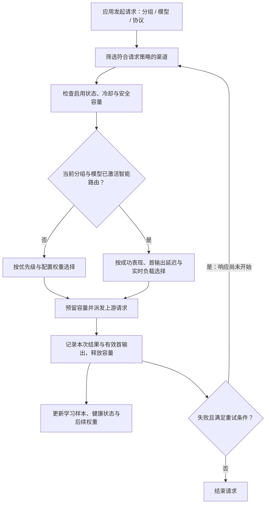
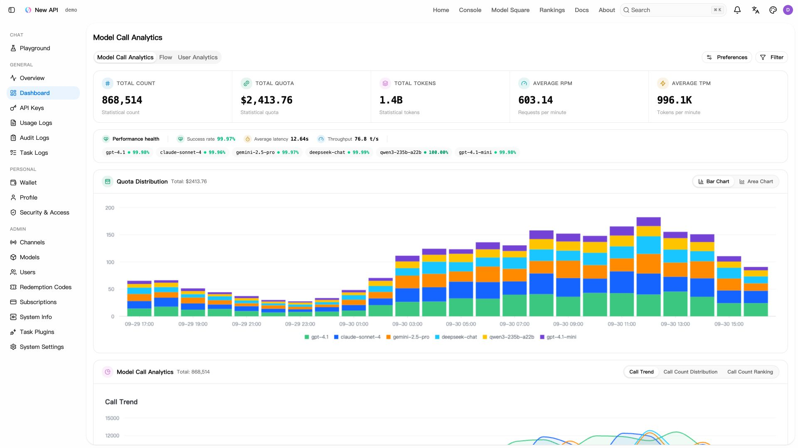
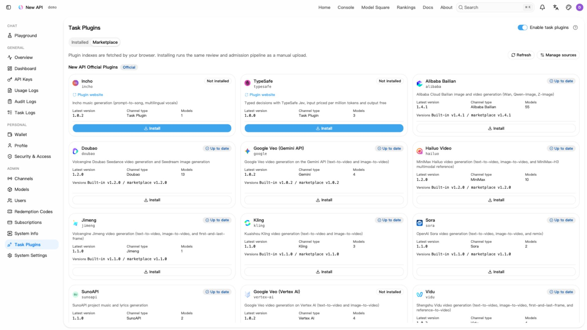
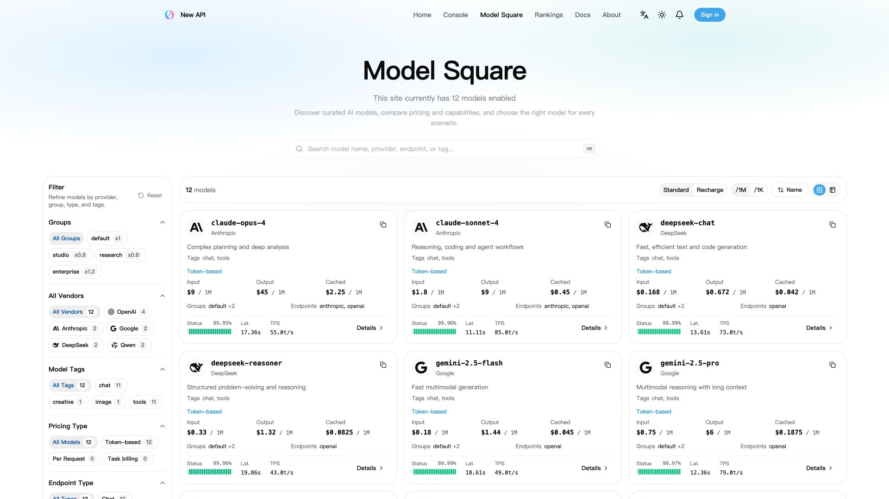
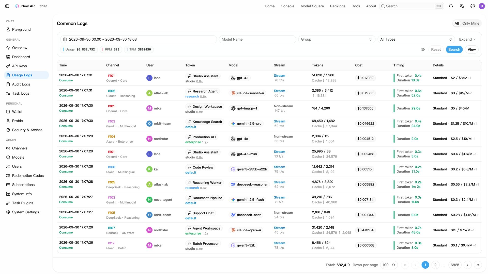

<div align="center">

# SmartRouter-v2 · 智能路由

**根据渠道成功率、首输出延迟与实时负载，动态分配 AI 请求**

[源码仓库](https://github.com/d100000/SmartRouter-v2) · [核心作用](#sr-purpose) · [路由机制](#sr-routing) · [调度中心](#sr-console) · [部署与接入](#sr-start) · [能力边界](#sr-limits)

</div>

SmartRouter-v2 是一个可自行部署的 AI 请求路由系统，位于应用与多个上游模型服务之间。应用使用统一 API 发起请求，系统在符合分组、模型和请求策略的渠道中，根据真实调用表现选择上游，并在允许重试的范围内完成故障回退。

**核心作用：把“这个模型的请求应该发到哪个渠道”变成持续根据运行数据调整的决策。** 渠道接入、动态分流、并发保护和运行状态查看，都在同一套控制台中管理。

本项目基于 [new-api](https://github.com/QuantumNous/new-api) 开发，保留其模型接入与管理基础，重点扩展自适应渠道调度。原项目署名、许可与说明保留在[文末](#sr-upstream)。

<a id="sr-purpose"></a>

## 核心作用与适用场景

当同一个模型可以通过多个渠道访问时，固定优先级或静态权重无法及时反映上游故障、响应变慢和并发拥堵。SmartRouter-v2 持续记录每次真实尝试的结果，让流量分配随渠道状态调整。

| 实际问题 | 系统如何处理 |
| --- | --- |
| 同一模型接入多个供应商，需要应用分别管理地址和密钥 | 提供统一 API 入口，在后台集中管理渠道、分组和模型映射 |
| 渠道时快时慢，人工修改权重跟不上变化 | 结合最近 5 分钟与 30 分钟的成功表现、首输出延迟和当前负载计算动态权重 |
| 部分渠道故障，重试继续命中同一故障渠道 | 动态重试排除已实际尝试的渠道，按剩余合格渠道的有效权重排序选择 |
| 一个上游账号被多个渠道或模型共用，容易同时超出并发 | 通过共享容量池统一计算当前实例的占用，满容量时停止向该池派发新请求 |
| 新渠道接入后直接承接大量业务，缺少表现依据 | 在存在已学习的健康替代渠道时，从受限流量开始，随成功样本逐步放量 |
| 只看到最终请求成功，无法判断中间是否发生大量重试 | 分开统计原始请求和渠道尝试，保留每次渠道失败，展示实际流量和预测分流概率 |

适合拥有多个同模型渠道、需要集中维护团队模型访问，或希望用实际运行数据调整流量的自托管场景。应用仍明确指定要调用的模型；本项目的智能调度对象是**渠道**，不根据提示词语义自动选择模型。

<a id="sr-routing"></a>

## 请求如何被路由



每次选择都先满足渠道启用、分组与模型匹配、协议及请求限制。显式固定渠道和严格会话绑定保留原有约束，也必须通过冷却与容量检查；动态评分不会绕过这些限制。

### 1. 冷启动、学习与动态分流

学习按 **分组 × 模型** 独立进行，渠道表现按 **分组 × 模型 × 渠道** 记录。

- **冷启动**：沿用优先级分层和配置权重，同时收集真实业务样本；当前层没有合格渠道时可以回退到下一层。
- **激活**：最近 30 分钟内累计达到 **50 个有效原始请求**，该分组与模型进入动态调度。业务请求首次得到成功或渠道故障结果时确认有效，并按业务开始时间计入窗口；重试不重复增加原始请求计数。
- **过渡**：配置权重的影响随本轮有效渠道尝试数增加而淡出，达到 **100 次有效尝试**后完全转为表现驱动。这些尝试包含冷启动样本和有效重试，不是激活后还要新增 100 个请求。
- **空闲重置**：连续 30 分钟没有新业务请求，且没有未结束业务或在途预留时，在下一次状态访问重新进入冷启动。实例重启也会重新学习。

### 2. 用真实表现计算权重

动态分配综合三个因素：

| 因素 | 计算依据 | 对路由的影响 |
| --- | --- | --- |
| 可靠性 | 5 分钟与 30 分钟窗口的成功和渠道失败，使用平滑估计控制小样本波动 | 持续失败或近期表现恶化的渠道降低权重 |
| 首输出延迟 | 成功尝试实际写给调用方的首个有效载荷；流式与非流式分别统计 | 首输出更快的渠道获得更高延迟评分 |
| 实时负载 | 当前容量池在途数与配置的安全并发容量 | 占用越高，负载折扣越大；满容量时不参与新派发 |

表现权重可概括为：

```text
表现权重 = 延迟评分 × 健康系数 ÷ (1 + 在途数 / 安全并发容量)
```

最终选择还会应用静态权重过渡、新渠道爬坡和健康替代渠道的分流规则。首次尝试按概率选择；动态重试按剩余渠道的实时有效权重降序选择。

心跳、空包、纯角色声明和终止元信息不算有效首输出。非流式请求以成功响应体首次写出时间作为近似，通常接近完整上游响应完成时间。没有测量样本时显示缺失值，不把它当成零延迟。

### 3. 故障处理与逐步恢复

- **即时降权**：渠道失败立即压低恢复上限；后续成功样本支持权重逐步恢复。用户取消、请求参数问题和相应业务拒绝不直接作为渠道故障。
- **短时冷却**：一分钟的故障序列内，累计 3 次符合条件的临时可用性故障，触发 15 秒冷却。适用故障包括请求发送失败及被分类为渠道故障的 `429 / 502 / 503 / 504`；成功或其他类型的有效结果会打断该故障序列。
- **新渠道爬坡**：存在成熟健康替代渠道时，零成功样本的新渠道合计以 5% 概率上限起步，随成功次数增加而放宽，单渠道达到 20 次成功后解除爬坡限制。该规则是流量上限，不是保底流量。
- **保留健康替代**：存在符合条件的健康替代渠道时，限制单渠道的首次选择概率不超过 90%。这不代表历史实际流量占比始终低于 90%。
- **保护已输出内容**：客户端取消、整体请求期限到达或响应已经开始后停止自动重试。已发送心跳也属于响应开始，不能在流式输出途中自动重放请求。

控制台的“解除降权”会解除渐进恢复限制并依据当前窗口重新计算；它保留失败历史、禁用状态、冷却和容量限制，不能保证立即恢复到某个权重。

### 4. 安全并发与共享容量池

选择渠道和预留容量在同一锁内完成，避免并发请求同时越过容量上限。流式请求持有预留直到流结束或请求终止，成功、失败与取消均会释放占用。

默认情况下，同一个渠道跨分组和模型共享其容量池。多个渠道实际使用同一上游账号时，可以配置相同的容量池标识，例如 `upstream-account-a`。共享池使用成员配置中最小的正容量：一个成员设置 20、另一个设置 50，生效上限为 20。

安全容量是管理员配置的主动限制，不是系统自动探测的上游配额；共享池也仅在当前实例内协调。

<a id="sr-console"></a>

## 调度中心：查看、配置与验证

管理员在侧边栏进入 **调度中心**（`/scheduling`），选择分组、模型及流式或非流式视角。页面每 15 秒拉取快照，也支持手动刷新。

| 区域 | 可以查看或操作什么 |
| --- | --- |
| 健康概览 | 原始请求量、渠道尝试量、5/30 分钟成功率、平均首输出时间、健康与合格渠道数、降权渠道数、当前并发和最大实际流量占比 |
| 30 分钟趋势 | 按分钟查看原始请求量、渠道实际成功率、首输出延迟和观测到的并发峰值 |
| 渠道明细 | 路由状态、实际流量、动态与配置权重、优先级、尝试次数、成功率、容量池占用、健康分、路由质量分和预测首次选择概率 |
| 路由配置 | 按分组与模型调整开关和目标，为渠道覆盖初始权重、安全容量与容量池标识 |
| 解除降权 | 对符合操作条件的渠道解除恢复限制，按当前表现重算权重 |

查看实际流量时应结合尝试次数判断重试放大；同一容量池的多行可能显示相同占用，不应直接相加。看板中的预测概率基于一般候选集合，具体请求还可能受固定渠道、会话或协议等限制。

默认配置如下：

| 配置 | 默认值 | 含义 |
| --- | --- | --- |
| 智能路由 | 开启 | 允许样本达到门槛后进入动态调度 |
| 成功率目标 | 95% | 用于健康判断和运营提示，不是可保证的 SLA |
| 首输出目标 | 3000 ms | 用于延迟评分及健康达标判断 |
| 安全并发容量 | 100 | 当前实例的默认容量门槛，应按实际账号能力调整 |
| 渠道权重覆盖 | 未设置 | 继承渠道原有配置权重 |
| 渠道容量覆盖 | 未设置 | 继承当前分组与模型的默认容量 |

调度参数通过控制台保存，不需要额外的 `SMART_ROUTING_*` 环境变量。权重设为零不能代替禁用；动态阶段仍可能向启用且合格的渠道分配流量。需要完全停止某渠道接收请求时，使用渠道禁用功能。

<a id="sr-start"></a>

## 部署与接入

### 从本仓库构建并运行

要使用本分支的智能路由功能，请构建本仓库源码。仓库原有 `docker-compose.yml` 仍默认使用上游 `calciumion/new-api:latest` 镜像，该镜像不能视为包含本分支功能的发布产物。

以下方式构建完整前后端，并以 SQLite 在本机启动单实例。需要安装 Git 和 Docker：

```bash
git clone https://github.com/d100000/SmartRouter-v2.git
cd SmartRouter-v2
docker build -t smartrouter-v2:local .
mkdir -p data
docker run --name smartrouter-v2 -d --restart unless-stopped \
  -p 127.0.0.1:3000:3000 \
  -e TZ=Asia/Shanghai \
  -v "$(pwd)/data:/data" \
  smartrouter-v2:local
```

打开 [http://localhost:3000](http://localhost:3000)，完成初始化。数据保存在挂载的 `data` 目录。需要 PostgreSQL、MySQL 和 Redis 时，可参考 [Compose 配置](./docker-compose.yml)，将应用服务的 `image` 改为本仓库构建的镜像，并配置对应连接串。

### 建立第一组路由

1. 新建至少两个渠道，填写上游地址、密钥和可用模型，为它们设置相同的分组与对外模型名称；需要时配置模型映射，并分别测试可用性。
2. 完成模型价格及可用额度等基础设置，创建允许访问对应分组与模型的 API Key。
3. 进入调度中心，选择该分组与模型，按实际上游能力设置安全并发；多个渠道共用同一账号时设置相同容量池标识。
4. 将应用的 OpenAI 兼容 Base URL 设为 `http://localhost:3000/v1`，使用控制台创建的 Key 发起真实业务请求。
5. 观察冷启动进度、渠道尝试和首输出样本；达到激活门槛后，检查动态权重和实际流量的变化。管理员渠道测试不增加业务激活计数。

例如，将 `SMARTROUTER_API_KEY` 设为控制台创建的 Key，并将 `your-enabled-model` 替换为配置好的模型名称：

```bash
curl --fail-with-body http://localhost:3000/v1/chat/completions \
  -H "Authorization: Bearer ${SMARTROUTER_API_KEY}" \
  -H "Content-Type: application/json" \
  -d '{"model":"your-enabled-model","messages":[{"role":"user","content":"Hello!"}],"stream":true}'
```

现有协议入口包括 OpenAI Chat Completions / Responses、Anthropic Messages 和 Gemini；实际可用接口、工具调用与多模态能力取决于上游模型、渠道配置和转换路径。

### 存储与运行配置

| 配置 | 用途 |
| --- | --- |
| `SQL_DSN` | 主数据库连接串；未设置时使用 SQLite，也支持 MySQL ≥ 5.7.8 和 PostgreSQL ≥ 9.6 |
| `LOG_SQL_DSN` | 可选的独立日志数据库，额外支持 ClickHouse |
| `REDIS_CONN_STRING` | Redis 连接串；不会使调度学习或容量池自动变成分布式状态 |

其他部署配置参阅 [.env.example](./.env.example) 与[鉴权及登录会话说明](./docs/authentication.md)。正式部署应配置持久化、备份、HTTPS 及反向代理的流式/WebSocket 支持；容器环境变量需通过运行参数或 Compose 注入。

<a id="sr-limits"></a>

## 当前能力边界

| 范围 | 当前实现 |
| --- | --- |
| 路由目标 | 在已指定模型的可用渠道间分配请求；没有按提示词语义选择模型、评判答案质量或按最低价格选路的机制 |
| 运行状态 | 学习样本、健康、趋势、冷却、在途及容量池均在当前进程内；多个实例各自学习、各自计算容量，不提供全局并发上限 |
| 配置持久化 | 调度配置保存在现有 options 存储；实例重启保留配置，学习状态和趋势重新采集 |
| 多实例配置管理 | 多进程同时修改整份配置可能覆盖彼此修改；建议由单个实例承担调度与配置管理 |
| 统计窗口 | 调度看板展示最近 30 分钟观测，没有跨全部分组汇总榜单、告警推送或长期调度历史报表 |
| 异步任务 | 调度统计覆盖提交阶段；异步生成最终成功率、轮询耗时和完整生成周期不属于当前渠道健康口径 |
| 固定渠道与会话 | 显式固定和严格绑定保留渠道约束，可能无法转到其他渠道；普通亲和在动态路由激活后让位于动态选择 |
| 性能目标 | 配置用于评分和调度判断，实际结果取决于上游表现、请求类型、样本量和可用容量 |

更完整的算法背景和指标说明见 [SCHEDULING.md](./SCHEDULING.md)。该文档部分细节尚未同步当前源码，冷却、爬坡及评分缓存行为请以当前代码为准。

<a id="sr-development"></a>

## 开发与代码结构

后端使用 Go / Gin，前端使用 React 19、TypeScript、Rsbuild、TanStack 和 Tailwind CSS 4。Go 基线见 [go.mod](./go.mod)，前端依赖与脚本使用 Bun。

```bash
# 在仓库根目录，先构建供后端嵌入的控制台
make build-web
go run .
```

开发时可在另一个终端运行 `make dev-web`，访问 [http://localhost:5173](http://localhost:5173)。也可使用 `make dev-api` 启动包含 PostgreSQL 和 Redis 的源码开发后端，再运行 `make dev-web`；开发后端的占位前端不用于完整控制台的生产部署。

| 位置 | 职责 |
| --- | --- |
| [pkg/scheduler/](./pkg/scheduler/) | 学习周期、窗口统计、动态评分、容量预留、爬坡与冷却 |
| [service/scheduler_routing.go](./service/scheduler_routing.go) | 渠道选择接入、每次尝试采集、首输出观察与重试边界 |
| [service/scheduling_config.go](./service/scheduling_config.go) | 调度配置校验、持久化与运行时应用 |
| [controller/scheduling.go](./controller/scheduling.go)、[router/scheduling-router.go](./router/scheduling-router.go) | 调度快照、配置与恢复操作接口 |
| [web/src/features/scheduling/](./web/src/features/scheduling/) | 调度健康看板、趋势、渠道明细与配置界面 |
| [relaykit/](./relaykit/README.md) | 独立的协议 DTO 与转换模块 |

贡献前阅读 [AGENTS.md](./AGENTS.md)。后端按改动范围执行 `make test`；前端在 `web/` 下执行 `bun run typecheck`、`bun run lint`、`bun run test` 和 `bun run build`。修改 RelayKit 后还需执行 `cd relaykit && GOWORK=off go build ./...`。

<a id="sr-upstream"></a>

## 上游来源与许可证

SmartRouter-v2 基于 **new-api / QuantumNous** 开发，遵循 [AGPLv3](./LICENSE) 及 [NOTICE](./NOTICE) 中的附加条款。原项目标识、作者署名和第三方声明予以保留，依赖许可见 [THIRD-PARTY-LICENSES.md](./THIRD-PARTY-LICENSES.md)。

下面完整保留上游原始 README。其截图、合作伙伴、发布渠道和镜像说明属于上游项目；部署本分支请使用上方“部署与接入”的构建方式。

<details>
<summary>展开上游 New API 原始说明、署名与许可信息</summary>

<div align="center">


# New API

**An AI gateway for models, applications, and agents**

<p align="center">
  <a href="./README.zh_CN.md">简体中文</a> |
  <a href="./README.zh_TW.md">繁體中文</a> |
  <strong>English</strong> |
  <a href="./README.fr.md">Français</a> |
  <a href="./README.ja.md">日本語</a>
</p>

<p align="center">
  <a href="https://raw.githubusercontent.com/Calcium-Ion/new-api/main/LICENSE">
    
  </a><!--
  --><a href="https://github.com/Calcium-Ion/new-api/releases/latest">
    
  </a><!--
  --><a href="https://hub.docker.com/r/CalciumIon/new-api">
    
  </a>
  <a href="https://atomgit.com/QuantumNous/new-api" target="_blank">
    
  </a>
</p>

<p align="center">
  <a href="https://trendshift.io/repositories/20180" target="_blank">
    
  </a>
  <br>
  <a href="https://hellogithub.com/repository/QuantumNous/new-api" target="_blank">
    
  </a><!--
  -->
  <a href="https://atomgit.com/QuantumNous/new-api" target="_blank">
    
  </a>
</p>

<p align="center">
  <a href="#screenshots">Screenshots</a> •
  <a href="#capabilities">Capabilities</a> •
  <a href="#quick-start">Quick start</a> •
  <a href="#deployment">Deployment</a> •
  <a href="#development">Development</a> •
  <a href="#documentation">Documentation</a>
</p>

</div>

---

## 📝 Project Description

New API is a self-hosted AI gateway for applications, agents, and teams. Connect upstream model services, expose a consistent API to your clients, and manage routing, access, usage, and costs in one place.

Use it to share authorized model access across a team, switch providers without configuring every client again, or operate a private multi-model service with a web console. Upstreams include OpenAI, Anthropic, Google Gemini, Azure OpenAI, AWS Bedrock, Vertex AI, DeepSeek, Qwen, and other compatible services.

> [!IMPORTANT]
> - This project is intended solely for lawful and authorized AI API gateway, organization-level authentication, multi-model management, usage analytics, cost accounting, and private deployment scenarios.
> - Users must lawfully obtain upstream API keys, accounts, model services, and interface permissions, and must comply with upstream terms of service and applicable laws and regulations.
> - Users should ensure their use complies with upstream terms of service and applicable laws and regulations.
> - When providing generative AI services to the public, users should comply with applicable regulatory requirements and fulfill all filing, licensing, content safety, real-name verification, log retention, tax, and upstream authorization obligations required by their jurisdiction.

<!-- -->

> [!WARNING]
> When operating this project as a public generative AI service or API resale service, users should first complete all required filing, licensing, content safety, real-name verification, log retention, tax, payment, and upstream authorization obligations.

---

<a id="screenshots"></a>

## Screenshots

Accounts, channels, plugin installation states, usage, prices, and costs shown below are simulated data. The marketplace displays the official plugin catalog. Click an image to view it at full size.

| Usage dashboard | Plugin marketplace |
| --- | --- |
| [](assets/screenshots/dashboard.en.jpg) | [](assets/screenshots/plugin-marketplace.en.jpg) |
| **Model square** | **Usage logs** |
| [](assets/screenshots/models.en.jpg) | [](assets/screenshots/usage-logs.en.jpg) |

---

## 🤝 Trusted Partners

<p align="center">
  <em>No particular order</em>
</p>

<p align="center">
  <a href="https://www.cherry-ai.com/" target="_blank">
    
  </a><!--
  --><a href="https://github.com/iOfficeAI/AionUi/" target="_blank">
    
  </a><!--
  --><a href="https://bda.pku.edu.cn/" target="_blank">
    
  </a><!--
  --><a href="https://www.aliyun.com/" target="_blank">
    
  </a><!--
  --><a href="https://io.net/" target="_blank">
    
  </a>
</p>

---

## 🙏 Special Thanks

<p align="center">
  <a href="https://www.jetbrains.com/?from=new-api" target="_blank">
    
  </a>
</p>

<p align="center">
  <strong>Thanks to <a href="https://www.jetbrains.com/?from=new-api">JetBrains</a> for providing free open-source development license for this project</strong>
</p>

---

<a id="capabilities"></a>

## Capabilities

| Area | What you can do |
| --- | --- |
| Model access | Use OpenAI Chat Completions, Responses, Anthropic Messages, and Gemini APIs; stream responses and use tools, reasoning, and multimodal inputs where supported |
| Routing | Configure model mappings, channel priorities and weights, retries, channel affinity, and multiple upstream keys |
| Usage and costs | Manage quotas, subscriptions, usage logs, cache accounting, and expression-based pricing for different usage tiers |
| Access control | Manage users, groups, fine-grained permissions, and API key restrictions; use OAuth/OIDC, passkeys, two-factor authentication, and login session management |
| Asynchronous tasks | Extend image, video, and other task APIs with JavaScript plugins, including task status and output retrieval |
| Web console | Configure channels and models, inspect usage and audit logs, and try models in the playground; available in English, Simplified Chinese, Traditional Chinese, French, Japanese, Russian, and Vietnamese |

### Protocols and endpoints

| Interface | Common endpoints |
| --- | --- |
| OpenAI Chat / Responses | `POST /v1/chat/completions`, `POST /v1/responses` |
| Anthropic Messages | `POST /v1/messages` |
| Gemini | `POST /v1beta/models/{model}:generateContent`, `POST /v1beta/models/{model}:streamGenerateContent` |
| Realtime / Responses WebSocket | `GET /v1/realtime`, `GET /v1/responses` (WebSocket upgrade) |
| Images / audio | `/v1/images/generations`, `/v1/images/edits`, `/v1/audio/speech`, `/v1/audio/transcriptions`, `/v1/audio/translations` |
| Embeddings / rerank | `POST /v1/embeddings`, `POST /v1/rerank` |
| Task plugins | `POST /v1/tasks/{pluginKey}`, `GET /v1/tasks/{taskId}`, plus routes declared by each plugin |

[RelayKit](./relaykit/README.md) provides request, response, and streaming conversion between the four text protocols. Available features depend on the channel, upstream model, and conversion path; protocol-specific tools and fields may not map exactly. WebSocket support also requires a compatible upstream and channel configuration.

This README describes the current source tree. Check the release notes for the version you deploy.

<a id="quick-start"></a>

## Quick start

### Try locally with Docker

This starts a single instance with SQLite and binds it to localhost:

```bash
mkdir -p data
docker run --name new-api -d --restart unless-stopped \
  -p 127.0.0.1:3000:3000 \
  -e TZ=Asia/Shanghai \
  -v "$(pwd)/data:/data" \
  calciumion/new-api:latest
```

Open [http://localhost:3000](http://localhost:3000) and complete the setup wizard to create the administrator account. The `data` directory persists the SQLite database across container replacements.

### Make your first request

1. Add a channel with your upstream API key, available models, and group assignment; run a channel test.
2. Configure model pricing and ensure the user has quota or a valid subscription.
3. Create an API key in the console with access to the same group and models.
4. Set your client's base URL to `http://localhost:3000/v1` for OpenAI-compatible clients and use the **New API-issued key**.

Set `NEW_API_KEY` in your shell to that key. List the models accessible to it:

```bash
curl --fail-with-body http://localhost:3000/v1/models \
  -H "Authorization: Bearer ${NEW_API_KEY}"
```

Then call Responses, replacing `your-enabled-model` with an enabled model that supports this interface:

```bash
curl --fail-with-body http://localhost:3000/v1/responses \
  -H "Authorization: Bearer ${NEW_API_KEY}" \
  -H "Content-Type: application/json" \
  -d '{"model":"your-enabled-model","input":"Hello!"}'
```

<a id="deployment"></a>

## Deployment

### Docker Compose

The repository's [Compose configuration](./docker-compose.yml) starts **New API + PostgreSQL + Redis** by default. It also contains examples for MySQL and a separate ClickHouse log database.

```bash
git clone https://github.com/QuantumNous/new-api.git
cd new-api
```

Before starting, edit `docker-compose.yml`: replace the database and Redis example passwords in both the services and connection strings, and set a persistent random `SESSION_SECRET` (generate one with `openssl rand -hex 32`). For an HTTPS console, configure `SESSION_COOKIE_SECURE=true` and `SESSION_COOKIE_TRUSTED_URL` with its exact public HTTPS origin.

```bash
docker compose up -d
docker compose logs -f new-api
```

### Storage and configuration

| Component | Options |
| --- | --- |
| Main database | SQLite, MySQL ≥ 5.7.8, or PostgreSQL ≥ 9.6 |
| Separate log database | Configure with `LOG_SQL_DSN`; also supports ClickHouse |
| Cache | Optional Redis plus in-memory caching; use shared Redis when application nodes need shared rate limits |
| Container platforms | Linux amd64 / arm64 |

| Variable | Purpose |
| --- | --- |
| `SQL_DSN` | Main database connection; unset uses SQLite |
| `LOG_SQL_DSN` | Optional separate log database connection |
| `REDIS_CONN_STRING` | Redis connection string |
| `SESSION_SECRET` | Persistent authentication secret; all nodes must use the same value |
| `CRYPTO_SECRET` | Defaults to `SESSION_SECRET`; nodes sharing Redis must use the same effective value |
| `SESSION_COOKIE_SECURE` | Set to `true` for an HTTPS console; enables Secure refresh cookies and strict refresh/logout origin checks |
| `SESSION_COOKIE_TRUSTED_URL` | Required in Secure mode: comma-separated exact HTTPS origins, without paths or wildcards; leave unset for local HTTP |
| `TRUSTED_PROXIES` | Trusted reverse-proxy IPs/CIDRs, or `none`; explicitly configure for your network |

See the [environment example](./.env.example), [environment reference](https://docs.newapi.ai/en/docs/installation/config-maintenance/environment-variables), and [authentication and session guide](./docs/authentication.md) for full configuration. Configure container variables in Compose's `environment` or `env_file`; copying `.env.example` alone does not inject variables into the container.

For production, put the console behind HTTPS and configure your reverse proxy for streaming and WebSocket upgrades. Persist and back up the database and mounted data. Multi-node deployments must share the main database and authentication secrets; separate Redis instances or in-memory rate limiters count limits independently per node. The session guide describes propagation behavior for each topology.

Pin an image version from [Releases](https://github.com/QuantumNous/new-api/releases), review its upgrade notes, and back up before upgrading. The `latest` tag follows published builds and can change; migrations and compatibility must be assessed for your existing installation.

<a id="development"></a>

## Development and extensions

The backend uses Go and Gin. The web console uses React 19, TypeScript, Rsbuild, TanStack, and Tailwind CSS 4. Use Bun for frontend dependencies and scripts; see [go.mod](./go.mod) for the Go language baseline and [Dockerfile](./Dockerfile) for the container build toolchain.

Build the frontend before starting the backend, which embeds `web/dist`:

```bash
# Repository root
cd web
bun install --frozen-lockfile
bun run build
cd ..
go run .
```

In a second terminal, start the frontend development server:

```bash
cd web
bun run dev -- --port 5173
```

Open [http://localhost:5173](http://localhost:5173); the development server proxies API requests to the backend on port 3000. For a containerized development backend, see [docker-compose.dev.yml](./docker-compose.dev.yml) and the `make dev` target in [makefile](./makefile).

| Location | Responsibility |
| --- | --- |
| `router/`, `middleware/`, `controller/` | HTTP routes, access checks, and API handlers |
| `relay/` | Upstream adapters and request routing |
| `service/`, `model/` | Business logic and persistence |
| [relaykit/](./relaykit/README.md) | Independently buildable Go module for protocol DTOs and conversions |
| [plugins/tasks/](./plugins/tasks/) | JavaScript task plugins; see [Task Plugin API v1](./docs/plugin-api/v1.md) for authoring and host boundaries |
| `web/` | Web console; see [frontend conventions](./web/AGENTS.md) |
| [electron/](./electron/README.md) | Desktop wrapper and packaging |

Read [AGENTS.md](./AGENTS.md) before contributing. Run checks appropriate to your change, including `make test` for the Go modules and `bun run typecheck`, `bun run lint`, `bun run test`, and `bun run build` in `web/` for frontend changes. Changes to RelayKit must also pass `GOWORK=off go build ./...` from `relaykit/`.

<a id="documentation"></a>

## Documentation and community

| Resource | Link |
| --- | --- |
| Official documentation | [Guides](https://docs.newapi.ai/en/docs) · [Installation](https://docs.newapi.ai/en/docs/installation) · [API reference](https://docs.newapi.ai/en/docs/api) |
| Project exploration | [DeepWiki](https://deepwiki.com/QuantumNous/new-api) |
| Questions and discussion | [FAQ](https://docs.newapi.ai/en/docs/support/faq) · [Community](https://docs.newapi.ai/en/docs/support/community-interaction) |
| Bugs and feature requests | [GitHub Issues](https://github.com/QuantumNous/new-api/issues) |
| Security reports | Follow the [security policy](./.github/SECURITY.md) for private reporting |

For bug reports, include the version, deployment method, reproduction steps, and redacted logs. Documentation, translations, provider integrations, and focused regression tests are all welcome contributions.

---

## 🔗 Related Projects

### Upstream Projects

| Project | Description |
|------|------|
| [One API](https://github.com/songquanpeng/one-api) | Original project base |
| [Midjourney-Proxy](https://github.com/novicezk/midjourney-proxy) | Midjourney interface support |

### Supporting Tools

| Project | Description |
|------|------|
| [new-api-key-tool](https://github.com/Calcium-Ion/new-api-key-tool) | Key quota query tool |
| [new-api-horizon](https://github.com/Calcium-Ion/new-api-horizon) | New API high-performance optimized version |

---

## 📜 License

This project is licensed under the [GNU Affero General Public License v3.0 (AGPLv3)](./LICENSE).

Additional terms under AGPLv3 Section 7 apply. Modified versions must preserve
the author attribution notice `Frontend design and development by New API
contributors.` in the appropriate legal notices and in any prominent about,
legal, footer, or attribution location presented by the user interface.

Modified versions that present a user interface must also preserve a visible
link to the original project: <https://github.com/QuantumNous/new-api>.

This is an open-source project developed based on [One API](https://github.com/songquanpeng/one-api) (MIT License).

If your organization's policies do not permit the use of AGPLv3-licensed software, or if you wish to avoid the open-source obligations of AGPLv3, please contact us at: [support@quantumnous.com](mailto:support@quantumnous.com)

See [NOTICE](./NOTICE) and [third-party licenses](./THIRD-PARTY-LICENSES.md) for attribution and dependency notices.

---

## 🌟 Star History

<div align="center">

[](https://star-history.com/#Calcium-Ion/new-api&Date)

</div>

---

<div align="center">

### 💖 Thank you for using New API

If this project is helpful to you, welcome to give us a ⭐️ Star！

**[Official Documentation](https://docs.newapi.ai/en/docs)** • **[Issue Feedback](https://github.com/Calcium-Ion/new-api/issues)** • **[Latest Release](https://github.com/Calcium-Ion/new-api/releases)**

<sub>Built with ❤️ by QuantumNous</sub>

</div>

</details>
