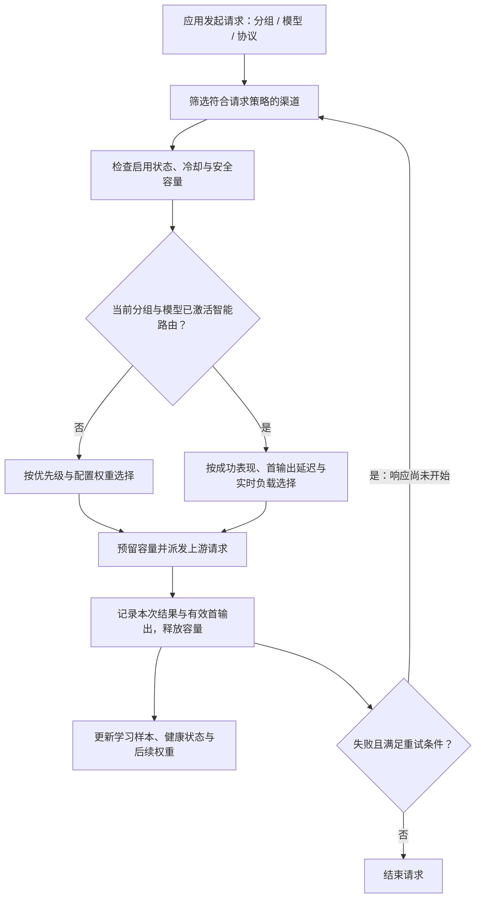
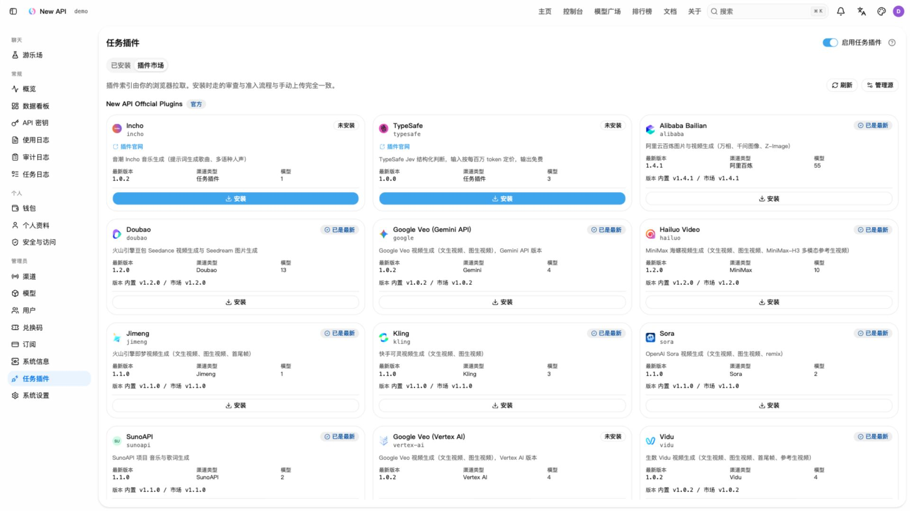
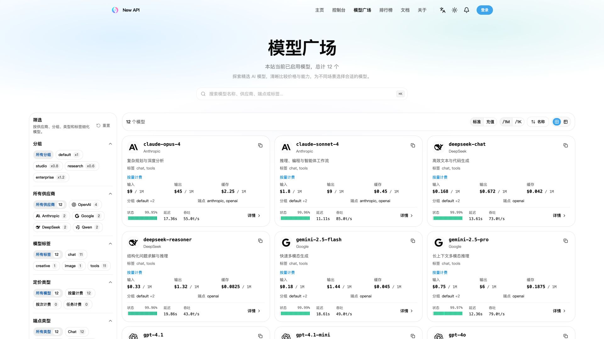
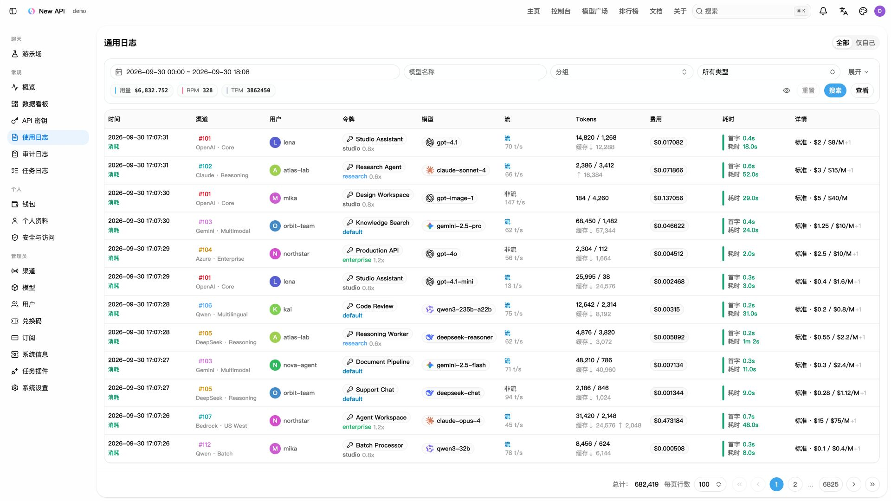

<div align="center">

# SmartRouter-v2 · 智能路由

**根据渠道成功率、首输出延迟与实时负载，动态分配 AI 请求**

[源码仓库](https://github.com/d100000/SmartRouter-v2) · [核心作用](#sr-purpose) · [路由机制](#sr-routing) · [调度中心](#sr-console) · [部署与接入](#sr-start) · [能力边界](#sr-limits)

</div>

SmartRouter-v2 是一个可自行部署的 AI 请求路由系统，位于应用与多个上游模型服务之间。应用使用统一 API 发起请求，系统在符合分组、模型和请求策略的渠道中，根据真实调用表现选择上游，并在允许重试的范围内完成故障回退。

**核心作用：把“这个模型的请求应该发到哪个渠道”变成持续根据运行数据调整的决策。** 渠道接入、动态分流、并发保护和运行状态查看，都在同一套控制台中管理。

本项目基于 [new-api](https://github.com/QuantumNous/new-api) 开发，保留其模型接入与管理基础，重点扩展自适应渠道调度。原项目署名、许可与说明保留在[文末](#sr-upstream)。

<a id="sr-purpose"></a>

## 核心作用与适用场景

当同一个模型可以通过多个渠道访问时，固定优先级或静态权重无法及时反映上游故障、响应变慢和并发拥堵。SmartRouter-v2 持续记录每次真实尝试的结果，让流量分配随渠道状态调整。

| 实际问题 | 系统如何处理 |
| --- | --- |
| 同一模型接入多个供应商，需要应用分别管理地址和密钥 | 提供统一 API 入口，在后台集中管理渠道、分组和模型映射 |
| 渠道时快时慢，人工修改权重跟不上变化 | 结合最近 5 分钟与 30 分钟的成功表现、首输出延迟和当前负载计算动态权重 |
| 部分渠道故障，重试继续命中同一故障渠道 | 动态重试排除已实际尝试的渠道，按剩余合格渠道的有效权重排序选择 |
| 一个上游账号被多个渠道或模型共用，容易同时超出并发 | 通过共享容量池统一计算当前实例的占用，满容量时停止向该池派发新请求 |
| 新渠道接入后直接承接大量业务，缺少表现依据 | 在存在已学习的健康替代渠道时，从受限流量开始，随成功样本逐步放量 |
| 只看到最终请求成功，无法判断中间是否发生大量重试 | 分开统计原始请求和渠道尝试，保留每次渠道失败，展示实际流量和预测分流概率 |

适合拥有多个同模型渠道、需要集中维护团队模型访问，或希望用实际运行数据调整流量的自托管场景。应用仍明确指定要调用的模型；本项目的智能调度对象是**渠道**，不根据提示词语义自动选择模型。

<a id="sr-routing"></a>

## 请求如何被路由



每次选择都先满足渠道启用、分组与模型匹配、协议及请求限制。显式固定渠道和严格会话绑定保留原有约束，也必须通过冷却与容量检查；动态评分不会绕过这些限制。

### 1. 冷启动、学习与动态分流

学习按 **分组 × 模型** 独立进行，渠道表现按 **分组 × 模型 × 渠道** 记录。

- **冷启动**：沿用优先级分层和配置权重，同时收集真实业务样本；当前层没有合格渠道时可以回退到下一层。
- **激活**：最近 30 分钟内累计达到 **50 个有效原始请求**，该分组与模型进入动态调度。业务请求首次得到成功或渠道故障结果时确认有效，并按业务开始时间计入窗口；重试不重复增加原始请求计数。
- **过渡**：配置权重的影响随本轮有效渠道尝试数增加而淡出，达到 **100 次有效尝试**后完全转为表现驱动。这些尝试包含冷启动样本和有效重试，不是激活后还要新增 100 个请求。
- **空闲重置**：连续 30 分钟没有新业务请求，且没有未结束业务或在途预留时，在下一次状态访问重新进入冷启动。实例重启也会重新学习。

### 2. 用真实表现计算权重

动态分配综合三个因素：

| 因素 | 计算依据 | 对路由的影响 |
| --- | --- | --- |
| 可靠性 | 5 分钟与 30 分钟窗口的成功和渠道失败，使用平滑估计控制小样本波动 | 持续失败或近期表现恶化的渠道降低权重 |
| 首输出延迟 | 成功尝试实际写给调用方的首个有效载荷；流式与非流式分别统计 | 首输出更快的渠道获得更高延迟评分 |
| 实时负载 | 当前容量池在途数与配置的安全并发容量 | 占用越高，负载折扣越大；满容量时不参与新派发 |

表现权重可概括为：

```text
表现权重 = 延迟评分 × 健康系数 ÷ (1 + 在途数 / 安全并发容量)
```

最终选择还会应用静态权重过渡、新渠道爬坡和健康替代渠道的分流规则。首次尝试按概率选择；动态重试按剩余渠道的实时有效权重降序选择。

心跳、空包、纯角色声明和终止元信息不算有效首输出。非流式请求以成功响应体首次写出时间作为近似，通常接近完整上游响应完成时间。没有测量样本时显示缺失值，不把它当成零延迟。

### 3. 故障处理与逐步恢复

- **即时降权**：渠道失败立即压低恢复上限；后续成功样本支持权重逐步恢复。用户取消、请求参数问题和相应业务拒绝不直接作为渠道故障。
- **短时冷却**：一分钟的故障序列内，累计 3 次符合条件的临时可用性故障，触发 15 秒冷却。适用故障包括请求发送失败及被分类为渠道故障的 `429 / 502 / 503 / 504`；成功或其他类型的有效结果会打断该故障序列。
- **新渠道爬坡**：存在成熟健康替代渠道时，零成功样本的新渠道合计以 5% 概率上限起步，随成功次数增加而放宽，单渠道达到 20 次成功后解除爬坡限制。该规则是流量上限，不是保底流量。
- **保留健康替代**：存在符合条件的健康替代渠道时，限制单渠道的首次选择概率不超过 90%。这不代表历史实际流量占比始终低于 90%。
- **保护已输出内容**：客户端取消、整体请求期限到达或响应已经开始后停止自动重试。已发送心跳也属于响应开始，不能在流式输出途中自动重放请求。

控制台的“解除降权”会解除渐进恢复限制并依据当前窗口重新计算；它保留失败历史、禁用状态、冷却和容量限制，不能保证立即恢复到某个权重。

### 4. 安全并发与共享容量池

选择渠道和预留容量在同一锁内完成，避免并发请求同时越过容量上限。流式请求持有预留直到流结束或请求终止，成功、失败与取消均会释放占用。

默认情况下，同一个渠道跨分组和模型共享其容量池。多个渠道实际使用同一上游账号时，可以配置相同的容量池标识，例如 `upstream-account-a`。共享池使用成员配置中最小的正容量：一个成员设置 20、另一个设置 50，生效上限为 20。

安全容量是管理员配置的主动限制，不是系统自动探测的上游配额；共享池也仅在当前实例内协调。

<a id="sr-console"></a>

## 调度中心：查看、配置与验证

管理员在侧边栏进入 **调度中心**（`/scheduling`），选择分组、模型及流式或非流式视角。页面每 15 秒拉取快照，也支持手动刷新。

| 区域 | 可以查看或操作什么 |
| --- | --- |
| 健康概览 | 原始请求量、渠道尝试量、5/30 分钟成功率、平均首输出时间、健康与合格渠道数、降权渠道数、当前并发和最大实际流量占比 |
| 30 分钟趋势 | 按分钟查看原始请求量、渠道实际成功率、首输出延迟和观测到的并发峰值 |
| 渠道明细 | 路由状态、实际流量、动态与配置权重、优先级、尝试次数、成功率、容量池占用、健康分、路由质量分和预测首次选择概率 |
| 路由配置 | 按分组与模型调整开关和目标，为渠道覆盖初始权重、安全容量与容量池标识 |
| 解除降权 | 对符合操作条件的渠道解除恢复限制，按当前表现重算权重 |

查看实际流量时应结合尝试次数判断重试放大；同一容量池的多行可能显示相同占用，不应直接相加。看板中的预测概率基于一般候选集合，具体请求还可能受固定渠道、会话或协议等限制。

默认配置如下：

| 配置 | 默认值 | 含义 |
| --- | --- | --- |
| 智能路由 | 开启 | 允许样本达到门槛后进入动态调度 |
| 成功率目标 | 95% | 用于健康判断和运营提示，不是可保证的 SLA |
| 首输出目标 | 3000 ms | 用于延迟评分及健康达标判断 |
| 安全并发容量 | 100 | 当前实例的默认容量门槛，应按实际账号能力调整 |
| 渠道权重覆盖 | 未设置 | 继承渠道原有配置权重 |
| 渠道容量覆盖 | 未设置 | 继承当前分组与模型的默认容量 |

调度参数通过控制台保存，不需要额外的 `SMART_ROUTING_*` 环境变量。权重设为零不能代替禁用；动态阶段仍可能向启用且合格的渠道分配流量。需要完全停止某渠道接收请求时，使用渠道禁用功能。

<a id="sr-start"></a>

## 部署与接入

### 从本仓库构建并运行

要使用本分支的智能路由功能，请构建本仓库源码。仓库原有 `docker-compose.yml` 仍默认使用上游 `calciumion/new-api:latest` 镜像，该镜像不能视为包含本分支功能的发布产物。

以下方式构建完整前后端，并以 SQLite 在本机启动单实例。需要安装 Git 和 Docker：

```bash
git clone https://github.com/d100000/SmartRouter-v2.git
cd SmartRouter-v2
docker build -t smartrouter-v2:local .
mkdir -p data
docker run --name smartrouter-v2 -d --restart unless-stopped \
  -p 127.0.0.1:3000:3000 \
  -e TZ=Asia/Shanghai \
  -v "$(pwd)/data:/data" \
  smartrouter-v2:local
```

打开 [http://localhost:3000](http://localhost:3000)，完成初始化。数据保存在挂载的 `data` 目录。需要 PostgreSQL、MySQL 和 Redis 时，可参考 [Compose 配置](./docker-compose.yml)，将应用服务的 `image` 改为本仓库构建的镜像，并配置对应连接串。

### 建立第一组路由

1. 新建至少两个渠道，填写上游地址、密钥和可用模型，为它们设置相同的分组与对外模型名称；需要时配置模型映射，并分别测试可用性。
2. 完成模型价格及可用额度等基础设置，创建允许访问对应分组与模型的 API Key。
3. 进入调度中心，选择该分组与模型，按实际上游能力设置安全并发；多个渠道共用同一账号时设置相同容量池标识。
4. 将应用的 OpenAI 兼容 Base URL 设为 `http://localhost:3000/v1`，使用控制台创建的 Key 发起真实业务请求。
5. 观察冷启动进度、渠道尝试和首输出样本；达到激活门槛后，检查动态权重和实际流量的变化。管理员渠道测试不增加业务激活计数。

例如，将 `SMARTROUTER_API_KEY` 设为控制台创建的 Key，并将 `your-enabled-model` 替换为配置好的模型名称：

```bash
curl --fail-with-body http://localhost:3000/v1/chat/completions \
  -H "Authorization: Bearer ${SMARTROUTER_API_KEY}" \
  -H "Content-Type: application/json" \
  -d '{"model":"your-enabled-model","messages":[{"role":"user","content":"Hello!"}],"stream":true}'
```

现有协议入口包括 OpenAI Chat Completions / Responses、Anthropic Messages 和 Gemini；实际可用接口、工具调用与多模态能力取决于上游模型、渠道配置和转换路径。

### 存储与运行配置

| 配置 | 用途 |
| --- | --- |
| `SQL_DSN` | 主数据库连接串；未设置时使用 SQLite，也支持 MySQL ≥ 5.7.8 和 PostgreSQL ≥ 9.6 |
| `LOG_SQL_DSN` | 可选的独立日志数据库，额外支持 ClickHouse |
| `REDIS_CONN_STRING` | Redis 连接串；不会使调度学习或容量池自动变成分布式状态 |

其他部署配置参阅 [.env.example](./.env.example) 与[鉴权及登录会话说明](./docs/authentication.md)。正式部署应配置持久化、备份、HTTPS 及反向代理的流式/WebSocket 支持；容器环境变量需通过运行参数或 Compose 注入。

<a id="sr-limits"></a>

## 当前能力边界

| 范围 | 当前实现 |
| --- | --- |
| 路由目标 | 在已指定模型的可用渠道间分配请求；没有按提示词语义选择模型、评判答案质量或按最低价格选路的机制 |
| 运行状态 | 学习样本、健康、趋势、冷却、在途及容量池均在当前进程内；多个实例各自学习、各自计算容量，不提供全局并发上限 |
| 配置持久化 | 调度配置保存在现有 options 存储；实例重启保留配置，学习状态和趋势重新采集 |
| 多实例配置管理 | 多进程同时修改整份配置可能覆盖彼此修改；建议由单个实例承担调度与配置管理 |
| 统计窗口 | 调度看板展示最近 30 分钟观测，没有跨全部分组汇总榜单、告警推送或长期调度历史报表 |
| 异步任务 | 调度统计覆盖提交阶段；异步生成最终成功率、轮询耗时和完整生成周期不属于当前渠道健康口径 |
| 固定渠道与会话 | 显式固定和严格绑定保留渠道约束，可能无法转到其他渠道；普通亲和在动态路由激活后让位于动态选择 |
| 性能目标 | 配置用于评分和调度判断，实际结果取决于上游表现、请求类型、样本量和可用容量 |

更完整的算法背景和指标说明见 [SCHEDULING.md](./SCHEDULING.md)。该文档部分细节尚未同步当前源码，冷却、爬坡及评分缓存行为请以当前代码为准。

<a id="sr-development"></a>

## 开发与代码结构

后端使用 Go / Gin，前端使用 React 19、TypeScript、Rsbuild、TanStack 和 Tailwind CSS 4。Go 基线见 [go.mod](./go.mod)，前端依赖与脚本使用 Bun。

```bash
# 在仓库根目录，先构建供后端嵌入的控制台
make build-web
go run .
```

开发时可在另一个终端运行 `make dev-web`，访问 [http://localhost:5173](http://localhost:5173)。也可使用 `make dev-api` 启动包含 PostgreSQL 和 Redis 的源码开发后端，再运行 `make dev-web`；开发后端的占位前端不用于完整控制台的生产部署。

| 位置 | 职责 |
| --- | --- |
| [pkg/scheduler/](./pkg/scheduler/) | 学习周期、窗口统计、动态评分、容量预留、爬坡与冷却 |
| [service/scheduler_routing.go](./service/scheduler_routing.go) | 渠道选择接入、每次尝试采集、首输出观察与重试边界 |
| [service/scheduling_config.go](./service/scheduling_config.go) | 调度配置校验、持久化与运行时应用 |
| [controller/scheduling.go](./controller/scheduling.go)、[router/scheduling-router.go](./router/scheduling-router.go) | 调度快照、配置与恢复操作接口 |
| [web/src/features/scheduling/](./web/src/features/scheduling/) | 调度健康看板、趋势、渠道明细与配置界面 |
| [relaykit/](./relaykit/README.md) | 独立的协议 DTO 与转换模块 |

贡献前阅读 [AGENTS.md](./AGENTS.md)。后端按改动范围执行 `make test`；前端在 `web/` 下执行 `bun run typecheck`、`bun run lint`、`bun run test` 和 `bun run build`。修改 RelayKit 后还需执行 `cd relaykit && GOWORK=off go build ./...`。

<a id="sr-upstream"></a>

## 上游来源与许可证

SmartRouter-v2 基于 **new-api / QuantumNous** 开发，遵循 [AGPLv3](./LICENSE) 及 [NOTICE](./NOTICE) 中的附加条款。原项目标识、作者署名和第三方声明予以保留，依赖许可见 [THIRD-PARTY-LICENSES.md](./THIRD-PARTY-LICENSES.md)。

下面完整保留上游原始 README。其截图、合作伙伴、发布渠道和镜像说明属于上游项目；部署本分支请使用上方“部署与接入”的构建方式。

<details>
<summary>展开上游 New API 原始说明、署名与许可信息</summary>

<div align="center">


# New API

**连接模型、应用与 Agent 的 AI 网关**

<p align="center">
  <strong>简体中文</strong> |
  <a href="./README.zh_TW.md">繁體中文</a> |
  <a href="./README.md">English</a> |
  <a href="./README.fr.md">Français</a> |
  <a href="./README.ja.md">日本語</a>
</p>

<p align="center">
  <a href="https://raw.githubusercontent.com/Calcium-Ion/new-api/main/LICENSE">
    
  </a><!--
  --><a href="https://github.com/Calcium-Ion/new-api/releases/latest">
    
  </a><!--
  --><a href="https://hub.docker.com/r/CalciumIon/new-api">
    
  </a>
  <a href="https://atomgit.com/QuantumNous/new-api" target="_blank">
    
  </a>
</p>

<p align="center">
  <a href="https://trendshift.io/repositories/20180" target="_blank">
    
  </a>
  <br>
  <a href="https://hellogithub.com/repository/QuantumNous/new-api" target="_blank">
    
  </a><!--
  -->
  <a href="https://atomgit.com/QuantumNous/new-api" target="_blank">
    
  </a>
</p>

<p align="center">
  <a href="#screenshots">项目截图</a> •
  <a href="#capabilities">核心能力</a> •
  <a href="#quick-start">快速开始</a> •
  <a href="#deployment">部署运维</a> •
  <a href="#development">开发扩展</a> •
  <a href="#documentation">文档社区</a>
</p>

</div>

---

## 📝 项目说明

New API 是面向应用、Agent 和团队的自托管 AI 网关。将不同厂商的模型服务接入统一入口，在同一套控制台中管理渠道、访问权限、用量与成本。

你可以用它为团队分配已授权的模型资源，在切换上游时减少客户端改动，或搭建自己的多模型服务。支持接入 OpenAI、Anthropic、Google Gemini、Azure OpenAI、AWS Bedrock、Vertex AI、DeepSeek、通义千问及其他兼容服务。

> [!IMPORTANT]
> - 本项目仅面向合法授权的 AI API 网关、组织内部鉴权、多模型管理、用量统计、成本核算和私有化部署场景。
> - 使用者必须合法取得上游 API Key、账号、模型服务或接口权限，并遵守上游服务条款及适用法律法规。
> - 使用者应确保其使用方式符合上游服务条款及适用法律法规。
> - 面向公众提供生成式人工智能服务时，使用者应遵守[《生成式人工智能服务管理暂行办法》](http://www.cac.gov.cn/2023-07/13/c_1690898327029107.htm)等监管要求，自行完成所在司法辖区要求的备案、许可、内容安全、实名、日志留存、税务和上游授权等合规义务。

<!-- -->

> [!WARNING]
> 将本项目作为面向公众的生成式 AI 服务或 API 转售服务运营时，使用者应先完成备案、内容安全、实名、日志留存、税务、支付和上游授权等合规义务。

---

<a id="screenshots"></a>

## 项目截图

以下账号、渠道、插件安装状态、用量、价格和费用均为模拟数据，插件市场展示官方目录。点击图片可查看原图。

| 数据看板 | 插件市场 |
| --- | --- |
| [](assets/screenshots/dashboard.zh-CN.jpg) | [](assets/screenshots/plugin-marketplace.zh-CN.jpg) |
| **模型广场** | **使用日志** |
| [](assets/screenshots/models.zh-CN.jpg) | [](assets/screenshots/usage-logs.zh-CN.jpg) |

---

## 🤝 我们信任的合作伙伴

<p align="center">
  <em>排名不分先后</em>
</p>

<p align="center">
  <a href="https://www.cherry-ai.com/" target="_blank">
    
  </a><!--
  --><a href="https://github.com/iOfficeAI/AionUi/" target="_blank">
    
  </a><!--
  --><a href="https://bda.pku.edu.cn/" target="_blank">
    
  </a><!--
  --><a href="https://www.aliyun.com/" target="_blank">
    
  </a><!--
  --><a href="https://io.net/" target="_blank">
    
  </a>
</p>

---

## 🙏 特别鸣谢

<p align="center">
  <a href="https://www.jetbrains.com/?from=new-api" target="_blank">
    
  </a>
</p>

<p align="center">
  <strong>感谢 <a href="https://www.jetbrains.com/?from=new-api">JetBrains</a> 为本项目提供免费的开源开发许可证</strong>
</p>

---

<a id="capabilities"></a>

## 核心能力

| 方向 | 可以做什么 |
| --- | --- |
| 模型接入 | 支持 OpenAI Chat Completions、Responses、Anthropic Messages 和 Gemini 协议，以及上游支持的流式输出、工具调用、推理与多模态输入 |
| 渠道调度 | 配置模型映射、渠道优先级与权重、失败重试、渠道亲和性和多密钥管理 |
| 用量与成本 | 管理额度、订阅套餐、用量日志、缓存计费，以及基于表达式的阶梯定价 |
| 访问控制 | 管理用户、分组、细粒度权限和 API Key 限制；支持 OAuth/OIDC、通行密钥、两步验证与登录会话管理 |
| 异步任务 | 通过 JavaScript 插件扩展图片、视频等任务 API，统一查询任务状态和获取产物 |
| Web 控制台 | 配置渠道与模型、查看用量和审计日志、在 Playground 中调试模型；支持简体中文、繁体中文、英语、法语、日语、俄语和越南语 |

### 协议与接口

| 接口类型 | 常用入口 |
| --- | --- |
| OpenAI Chat / Responses | `POST /v1/chat/completions`、`POST /v1/responses` |
| Anthropic Messages | `POST /v1/messages` |
| Gemini | `POST /v1beta/models/{model}:generateContent`、`POST /v1beta/models/{model}:streamGenerateContent` |
| Realtime / Responses WebSocket | `GET /v1/realtime`、`GET /v1/responses`（WebSocket 升级） |
| 图片 / 音频 | `/v1/images/generations`、`/v1/images/edits`、`/v1/audio/speech`、`/v1/audio/transcriptions`、`/v1/audio/translations` |
| 向量 / 重排 | `POST /v1/embeddings`、`POST /v1/rerank` |
| 任务插件 | `POST /v1/tasks/{pluginKey}`、`GET /v1/tasks/{taskId}`，以及各插件声明的协议路由 |

[RelayKit](./relaykit/README.md) 提供上述四种文本协议之间的请求、响应和流式转换。实际可用能力取决于渠道、上游模型和转换路径；协议特有的工具与字段可能无法完整映射。WebSocket 同样需要上游与渠道配置支持。

本 README 描述当前源码的能力，部署时请同时查看所选版本的发布说明。

<a id="quick-start"></a>

## 快速开始

### 使用 Docker 本地体验

以下命令使用 SQLite 启动单实例，仅监听本机端口：

```bash
mkdir -p data
docker run --name new-api -d --restart unless-stopped \
  -p 127.0.0.1:3000:3000 \
  -e TZ=Asia/Shanghai \
  -v "$(pwd)/data:/data" \
  calciumion/new-api:latest
```

打开 [http://localhost:3000](http://localhost:3000)，按初始化向导创建管理员账号。SQLite 数据库存放在挂载的 `data` 目录中，更换容器后仍会保留。

### 发起第一次请求

1. 新建渠道，填写上游 API Key、可用模型和所属分组，执行渠道测试。
2. 配置模型价格，确保调用用户有可用额度或有效订阅。
3. 在控制台创建 API Key，确保它能访问对应分组和模型。
4. 对于 OpenAI 兼容客户端，将 Base URL 设为 `http://localhost:3000/v1`，密钥使用 **New API 签发的 Key**。

在终端中将 `NEW_API_KEY` 环境变量设为该密钥，查询它可以访问的模型：

```bash
curl --fail-with-body http://localhost:3000/v1/models \
  -H "Authorization: Bearer ${NEW_API_KEY}"
```

然后调用 Responses，将 `your-enabled-model` 替换为已启用且支持该接口的模型名称：

```bash
curl --fail-with-body http://localhost:3000/v1/responses \
  -H "Authorization: Bearer ${NEW_API_KEY}" \
  -H "Content-Type: application/json" \
  -d '{"model":"your-enabled-model","input":"Hello!"}'
```

<a id="deployment"></a>

## 部署与运维

### Docker Compose

仓库的 [Compose 配置](./docker-compose.yml) 默认启动 **New API + PostgreSQL + Redis**，并提供 MySQL 和独立 ClickHouse 日志库的配置示例。

```bash
git clone https://github.com/QuantumNous/new-api.git
cd new-api
```

启动前编辑 `docker-compose.yml`：同时替换数据库、Redis 服务及对应连接串中的示例密码，并设置固定的随机 `SESSION_SECRET`（可用 `openssl rand -hex 32` 生成）。通过 HTTPS 访问控制台时，设置 `SESSION_COOKIE_SECURE=true`，并在 `SESSION_COOKIE_TRUSTED_URL` 中填写控制台对外的精确 HTTPS Origin。

```bash
docker compose up -d
docker compose logs -f new-api
```

### 存储与配置

| 组件 | 可选方案 |
| --- | --- |
| 主数据库 | SQLite、MySQL ≥ 5.7.8、PostgreSQL ≥ 9.6 |
| 独立日志库 | 通过 `LOG_SQL_DSN` 配置，额外支持 ClickHouse |
| 缓存 | 可选 Redis 与内存缓存；多节点需要共享限流额度时使用共享 Redis |
| 容器平台 | Linux amd64 / arm64 |

| 环境变量 | 用途 |
| --- | --- |
| `SQL_DSN` | 主数据库连接串；未设置时使用 SQLite |
| `LOG_SQL_DSN` | 可选的独立日志数据库连接串 |
| `REDIS_CONN_STRING` | Redis 连接串 |
| `SESSION_SECRET` | 持久保存的鉴权密钥，所有节点必须一致 |
| `CRYPTO_SECRET` | 默认使用 `SESSION_SECRET`；共享 Redis 的节点必须使用相同的有效值 |
| `SESSION_COOKIE_SECURE` | HTTPS 控制台设为 `true`，启用 Secure 刷新 Cookie 和严格的刷新／退出来源校验 |
| `SESSION_COOKIE_TRUSTED_URL` | Secure 模式必填：以逗号分隔的精确 HTTPS Origin，不含路径或通配符；本地 HTTP 模式不设置 |
| `TRUSTED_PROXIES` | 可信反向代理 IP/CIDR，或 `none`；按实际网络显式配置 |

完整配置见[环境变量示例](./.env.example)、[环境变量文档](https://docs.newapi.ai/zh/docs/installation/config-maintenance/environment-variables)和[鉴权与登录会话说明](./docs/authentication.md)。容器变量应通过 Compose 的 `environment` 或 `env_file` 注入；只复制 `.env.example` 不会自动将变量传入容器。

正式部署时使用 HTTPS，并配置反向代理支持流式响应与 WebSocket 升级。持久化并备份数据库和挂载数据。多节点必须共用主数据库和鉴权密钥；独立 Redis 或内存限流器会按节点分别计数。不同拓扑下的会话传播行为见鉴权文档。

从[发布页](https://github.com/QuantumNous/new-api/releases)选择明确的镜像版本，阅读升级说明并先备份再升级。`latest` 会随发布构建变化；已有实例应按实际版本评估迁移与兼容性。

<a id="development"></a>

## 开发与扩展

后端使用 Go 和 Gin；控制台使用 React 19、TypeScript、Rsbuild、TanStack 与 Tailwind CSS 4。前端依赖和脚本使用 Bun；Go 语言基线见 [go.mod](./go.mod)，容器构建工具链见 [Dockerfile](./Dockerfile)。

后端会嵌入 `web/dist`，首次启动前先构建前端：

```bash
# 仓库根目录
cd web
bun install --frozen-lockfile
bun run build
cd ..
go run .
```

在另一个终端启动前端开发服务器：

```bash
cd web
bun run dev -- --port 5173
```

访问 [http://localhost:5173](http://localhost:5173)，开发服务器会将 API 请求代理到 3000 端口的后端。需要容器化开发后端时，参阅 [docker-compose.dev.yml](./docker-compose.dev.yml) 和 [makefile](./makefile) 中的 `make dev`。

| 目录 | 职责 |
| --- | --- |
| `router/`、`middleware/`、`controller/` | HTTP 路由、访问校验与 API 处理 |
| `relay/` | 上游适配与请求调度 |
| `service/`、`model/` | 业务逻辑与持久化 |
| [relaykit/](./relaykit/README.md) | 可独立构建的协议 DTO 与转换 Go 模块 |
| [plugins/tasks/](./plugins/tasks/) | JavaScript 任务插件；编写方式与宿主边界见 [Task Plugin API v1](./docs/plugin-api/v1.md) |
| `web/` | Web 控制台，参阅[前端开发约定](./web/AGENTS.md) |
| [electron/](./electron/README.md) | 桌面封装与打包 |

贡献前请阅读 [AGENTS.md](./AGENTS.md)。按改动范围执行检查：Go 模块使用 `make test`；前端在 `web/` 下运行 `bun run typecheck`、`bun run lint`、`bun run test` 和 `bun run build`。修改 RelayKit 后还必须在 `relaykit/` 下执行 `GOWORK=off go build ./...`。

<a id="documentation"></a>

## 文档与社区

| 资源 | 入口 |
| --- | --- |
| 官方文档 | [使用指南](https://docs.newapi.ai/zh/docs) · [安装部署](https://docs.newapi.ai/zh/docs/installation) · [API 参考](https://docs.newapi.ai/zh/docs/api) |
| 项目导读 | [DeepWiki](https://deepwiki.com/QuantumNous/new-api) |
| 使用问题与交流 | [常见问题](https://docs.newapi.ai/zh/docs/support/faq) · [社区渠道](https://docs.newapi.ai/zh/docs/support/community-interaction) |
| 缺陷与功能建议 | [GitHub Issues](https://github.com/QuantumNous/new-api/issues) |
| 安全漏洞 | 按[安全政策](./.github/SECURITY.md)进行私下报告 |

反馈问题时请附上版本、部署方式、复现步骤及脱敏日志。欢迎贡献文档、翻译、渠道适配和有针对性的回归测试。

---

## 🔗 相关项目

### 上游项目

| 项目 | 说明 |
|------|------|
| [One API](https://github.com/songquanpeng/one-api) | 原版项目基础 |
| [Midjourney-Proxy](https://github.com/novicezk/midjourney-proxy) | Midjourney 接口支持 |

### 配套工具

| 项目 | 说明 |
|------|------|
| [new-api-key-tool](https://github.com/Calcium-Ion/new-api-key-tool) | Key 额度查询工具 |
| [new-api-horizon](https://github.com/Calcium-Ion/new-api-horizon) | New API 高性能优化版 |

---

## 📜 许可证

本项目采用 [GNU Affero 通用公共许可证 v3.0 (AGPLv3)](./LICENSE) 授权。

根据 AGPLv3 第 7 条，本项目还适用[附加条款](./NOTICE)。修改版本必须在适当法律声明及界面中显著的关于、法律、页脚或署名位置保留作者署名 `Frontend design and development by New API contributors.`，并保留指向原项目 <https://github.com/QuantumNous/new-api> 的可见链接。

本项目为开源项目，在 [One API](https://github.com/songquanpeng/one-api)（MIT 许可证）的基础上进行二次开发。

如果您所在的组织政策不允许使用 AGPLv3 许可的软件，或您希望规避 AGPLv3 的开源义务，请发送邮件至：[support@quantumnous.com](mailto:support@quantumnous.com)

署名及依赖声明见 [NOTICE](./NOTICE) 和[第三方许可证](./THIRD-PARTY-LICENSES.md)。

---

## 🌟 Star History

<div align="center">

[](https://star-history.com/#Calcium-Ion/new-api&Date)

</div>

---

<div align="center">

### 💖 感谢使用 New API

如果这个项目对你有帮助，欢迎给我们一个 ⭐️ Star！

**[官方文档](https://docs.newapi.ai/zh/docs)** • **[问题反馈](https://github.com/Calcium-Ion/new-api/issues)** • **[最新发布](https://github.com/Calcium-Ion/new-api/releases)**

<sub>Built with ❤️ by QuantumNous</sub>

</div>

</details>
